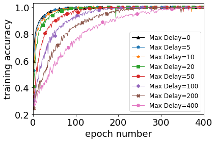
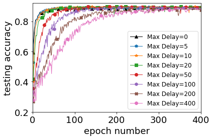
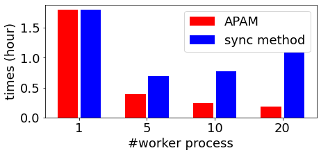
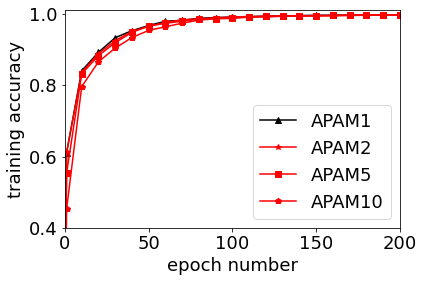
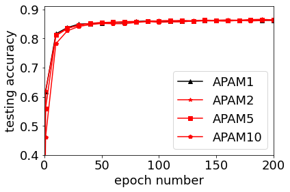
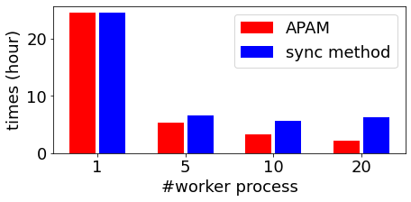
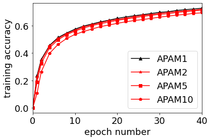
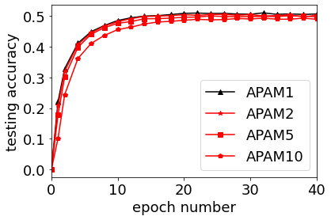
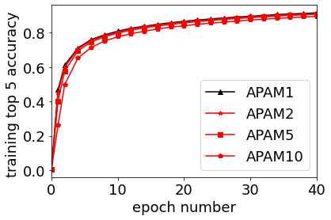
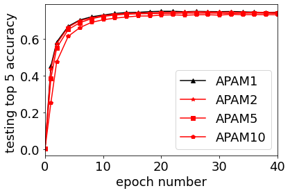

# APAM: Parallel and distributed asynchronous adaptive stochastic gradient methods

This repository contains a Python-MP4PY implementation of APAM [(Xu et al. 2020)](#Xu2020).

The results in section 5.4 and section 5.5 are given in this repository.
  

## Usage 

- The folder "models" includes the neural network models ('AllCNN, resnet18, wideresnet28_5').
- The folder "pictures" includes the plotted results.

- "read_datasets.py" includes the data reading functions. With the dataset name ('cifar10, CINIC-10, imagenet32'), it returns the train_dataset and test_dataset. The location of the data should be provided as an input. The default location is "./data/data_name". 
-  The folder "data" is the default data location. There, "about_data.txt" includes more information about the used three datasets.

### Running APAM with artificial delay
- "cifar10_allcnn_artifical_maxdelay.py" implements the APAM with a given artificial maximum delay for training the AllCNN network on the Cifar10 dataset corresponding to section 5.4.
- "run_artifical_delay.sh" tests APAM with different maximum artificial delays. 

### Tests on larger datasets 
- "main_apam.py" is the main function to train the given neural networks on the given dataset corresponding to section 5.5. Its inputs include the name of the neural network, the name of the dataset, apam or sgd, async or sync, use GPU or not, and other hyper-parameters. 
- "optim_and_train_apam.py" includes functions called in main_apam.py, including the APAM solver, test function, and train function for one epoch on the master and workers in async and sync communication modes.
- "run_training_larger_datasets.sh" first tests the training of resnet18 on the CINIC-10, then the training of wideresnet28_5 on the imagenet32. 

## Performance

On a Dell workstation with 32 CPU cores, 64 GB memory, and two Quadro RTX 500 GPUs.

### Results with artificial delay 
 

predication accuracy by APAM for training the AllCNN network on Cifar10 dataset with Python implementation and artificial delay.

### training the Resnet18 network on [CINIC10 dataset](https://github.com/BayesWatch/cinic-10)

running time (hour) on CPU by APAM and the sync-parallel AMSGrad with Python and MPI4PY implementation for one epoch

 

prediction accuracy by APAM and the sync-parallel AMSGrad with Python and MPI4PY implementation for training the Resnet18 network on CINIC10 dataset.

### training the WRN-28-5 on [Imagenet32 dataset](https://image-net.org/download-images)  

running time (hour) on CPU by APAM and the sync-parallel AMSGrad with Python and MPI4PY implementation for one epoch

 
 

prediction accuracy by APAM and the sync-parallel AMSGrad with Python and MPI4PY implementation for training the WRN-28-5 network on Imagenet32 dataset.

## Reference

- Yangyang Xu, Yibo Xu, Yonggui Yan, Colin Sutcher-Shepard, Leopold Grinberg, and Jie Chen. [Parallel and distributed asynchronous adaptive stochastic gradient methods](https://arxiv.org/abs/2002.09095). Preprint arXiv:2002.09095, 2020.
